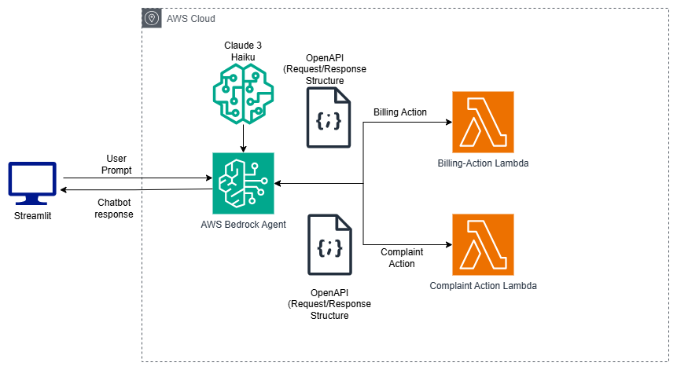
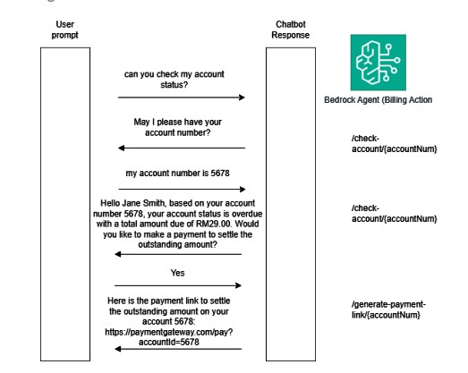

# 💬 Chatbot Agent (Streamlit + AWS Bedrock + Claude 3 Haiku)

This project is an intelligent customer support chatbot, leveraging **Streamlit** for the frontend, **AWS Bedrock Agent** for orchestration, and **Claude 3 Haiku** as the underlying LLM.

The chatbot understands natural language input and routes user requests to either:

- **Billing Action**  
- **Complaint Action**

Each action is defined via **OpenAPI schema** and implemented using **AWS Lambda**.

---

## 🧩 Architecture Overview



### Components

- **Streamlit**: Frontend UI for user interaction.
- **Claude 3 Haiku (via Bedrock)**: Foundation model used for understanding and reasoning.
- **AWS Bedrock Agent**: Handles user input, routes to proper action based on intent using OpenAPI action schemas.
- **Lambda Functions**:
  - `Billing Action`: Processes billing inquiries.
  - `Complaint Action`: Handles service complaints.
- **OpenAPI Definitions**: Define the request/response structure and operations for each action.

---


## 🚀 How It Works

1. User interacts via the **Streamlit** interface.
2. User input is sent to **AWS Bedrock Agent**.
3. The Agent uses **Claude 3 Haiku** to understand the user's intent.
4. Depending on the intent:
   - For **Billing** → triggers `Billing Action` Lambda
   - For **Complaint** → triggers `Complaint Action` Lambda
5. The response is returned to the user through Streamlit.

### Example prompt


---

## 🛠️ Setup & Deployment

### Prerequisites

- AWS Account with Bedrock access
- IAM permissions to create Agents and invoke Lambda
- Python 3.9+

### 1. Deploy Lambda Functions

Deploy each Lambda function (`billing_handler.py` and `complaint_handler.py`) with appropriate IAM roles.

### 2. Upload OpenAPI Schemas to Bedrock Agent

Go to **AWS Bedrock Console** → Create an **Agent** → Add both action groups by uploading:
- `billing-action.yaml`
- `complaint-action.yaml`

Map each OpenAPI operation to the respective Lambda function.

### 3. Launch Streamlit App

```bash
cd frontend
pip install -r requirements.txt
streamlit run Home.py
```

